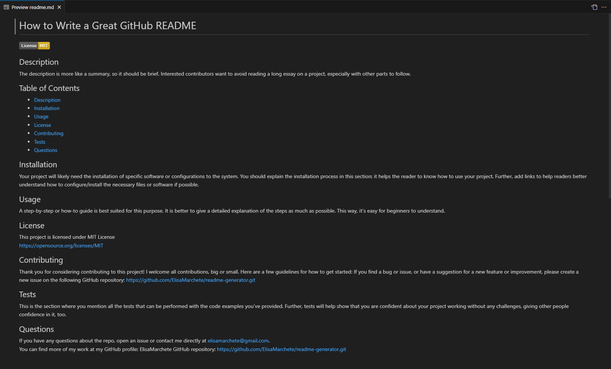

# Professional README Generator

## Description
This is a command-line application that allows users to easily generate a professional README file for their projects. The user can simply answer a few prompts in the terminal and the application will automatically generate a README file for them.

## Table of Contents
* [Installation](#installation)
* [Usage](#usage)
* [License](#license)

## Installation
To install this application, clone the repository and navigate to the project directory in your terminal. Then, run the following command to install the required dependencies: 
- npm install

## Usage
To use this application, navigate to the project directory in your terminal and run the following command:
- node index.js

The application will then prompt you to answer a series of questions about your project, including the project title, description, installation instructions, usage information, contribution guidelines, and test instructions. Once you have answered all of the prompts, the application will generate a professional README file for your project in the 'README' folder.

## License
This application is licensed under the MIT license.

## Screenshot of a README.md sample generated using the application

## Link to walkthrough video and GitHub repository
[Link walkthrough video Screencastify Google Drive](https://watch.screencastify.com/v/zAMxJKDXt1KeInCHeQha)  
[Link GitHub repository](https://elisamarchete.github.io/readme-generator/)

